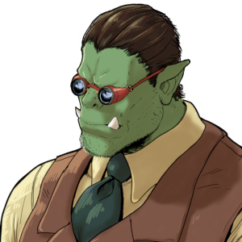

  

## My Github Stats

 
 

## Who Am I?
- **Name:** Lucien Cartier-Tilet
- **Aliases:** Phundrak, P’undrak, Drak-pa
- **Location:** Paris, France
- **Occupation:** CS Student, M.D. candidate
- **Websites:**
  - **Main Website:** [phundrak.com](https://phundrak.com/en)
  - **Gitea Instance:** [labs.phundrak.com](https://labs.phundrak.com)
  - **Linux Configuration:** [config.phundrak.com](https://config.phundrak.com)
  - **Conlanging:** [langue.phundrak.com](https://langue.phundrak.com/)
- **Social Media:**
  - **Twitter:** [@Phundrak](https://twitter.com/phundrak)
  - **Discord:** Phundrak#0001
- **Languages Spoken:**
  - **Fluently:** French (native), English
  - **Learning:** Elefen (conversational), Japanese (basics), Norwegian Bοkmål (notions)

## My Fields of Interest
- Emacs
- GNU/Linux
- System Administration (currently managing six servers)
- Linguistics
- Conlanging
- Worldbuilding
- Writing
